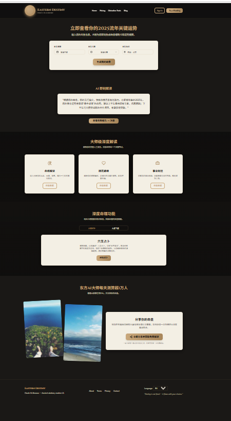
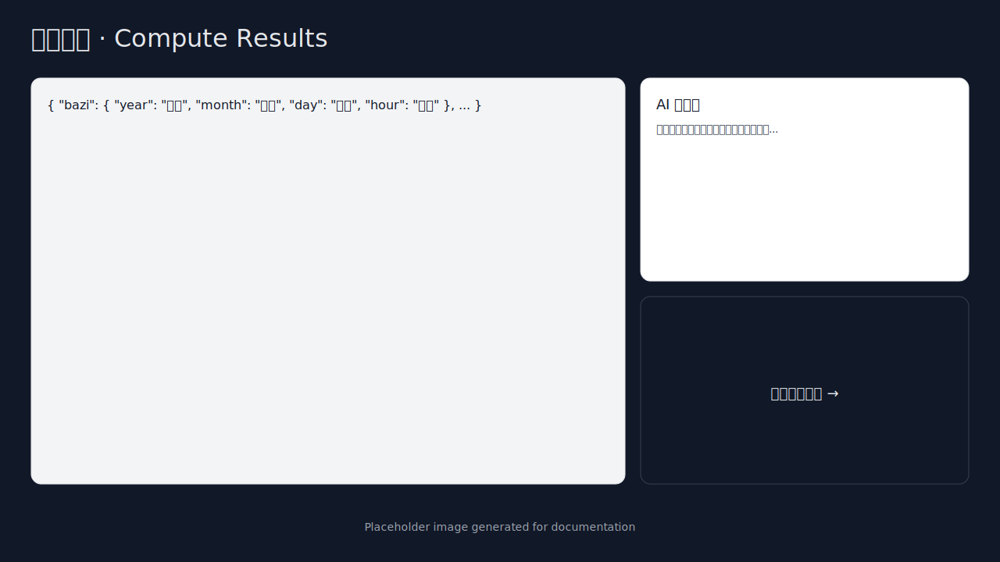
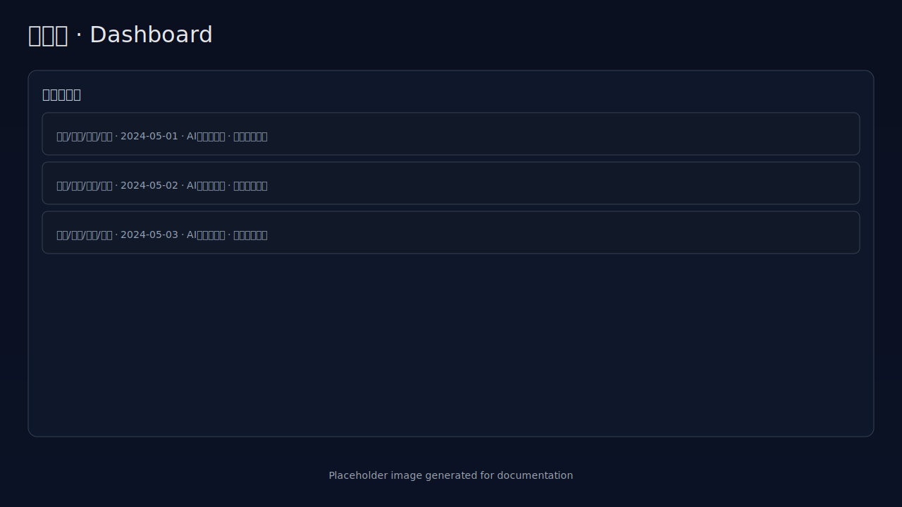

# Eastern Destiny — V1 TypeScript MVP

[](https://vercel.com/new/clone?repository-url=https://github.com/yourusername/eastern-destiny)

Eastern Destiny is a lightweight MVP project that provides Chinese BaZi (八字) fortune-telling calculations with AI-powered interpretations. This project demonstrates integration of modern web technologies with traditional Chinese astrology.

## Overview

This application allows users to:
- Input birth information (date, time, timezone) to generate BaZi charts
- Receive AI-powered interpretations of their charts
- Purchase detailed fortune reports via Stripe
- View and manage their generated charts

## Table of Contents

- [Overview](#overview)
- [Features](#features)
- [Design System](#design-system)
- [Demo](#demo)
- [Tech Stack](#tech-stack)
- [Prerequisites](#prerequisites)
- [Quick Start](#quick-start)
- [Environment Setup](#environment-setup)
- [Project Structure](#project-structure)
- [Key Features & Implementation](#key-features--implementation)
- [API Overview](#api-overview)
- [Deployment](#deployment)
- [Development](#development)
- [Run Tests](#6-run-tests)
- [MVP Limitations](#mvp-limitations)
- [License](#license)
- [Support](#support)
- [Roadmap](#roadmap)

## Features

Eastern Destiny provides a complete BaZi fortune-telling experience with modern technology:

- 🎯 **Profile Creation** - Input birth information with accurate timezone handling
- 📊 **Chart Computation** - Generate Four Pillars (BaZi) with proper Gan-Zhi calculation
- 🤖 **AI Interpretation** - Get instant AI-powered insights using Google Gemini 2.5 Pro
- 🎲 **Daily Fortune** - Draw daily fortune sticks with AI interpretation (one per day)
- 🏮 **Prayer Lamps** - Purchase and light virtual prayer lamps for blessings ($19.90 each)
- 💳 **Stripe Checkout** - Secure payment processing for detailed fortune reports and lamp purchases
- 📄 **Report Generation** - Background worker generates comprehensive fortune reports
- 📱 **Modern UI** - Responsive design with Tailwind CSS and custom design system
- 🔒 **Secure & Scalable** - Built on Supabase with PostgreSQL database

## Design System

Eastern Destiny uses a custom design system built on top of Tailwind CSS to ensure consistent styling across the application.

### Design Tokens

The design system is defined in `src/lib/theme.ts` with the following tokens:

#### Brand Colors
- **Primary**: Blue color palette (`brand-primary-50` to `brand-primary-900`)
- **Secondary**: Pink color palette (`brand-secondary-50` to `brand-secondary-900`)  
- **Accent**: Amber color palette (`brand-accent-50` to `brand-accent-900`)

#### Typography Scale
- Consistent font sizes from `xs` (12px) to `7xl` (72px)
- Responsive heading scales with proper line heights
- Semantic text colors (primary, secondary, muted, accent, danger)

#### Spacing System
- Consistent spacing scale from `xs` (8px) to `4xl` (96px)
- Standard section padding: `py-16 md:py-24`
- Container max-widths: `max-w-screen-xl` and `max-w-screen-2xl`

#### Shadows & Effects
- Soft shadows for subtle depth (`shadow-soft`)
- Medium shadows for elevated elements (`shadow-medium`)
- Custom animations: `fade-in`, `slide-up`, `bounce-soft`

### UI Components

All shared components are located in `components/ui/`:

#### Core Components
- **Button** - Variants: primary, secondary, outline, ghost, danger
- **Input** - With label, error states, helper text, icons
- **Card** - Variants: default, elevated, outlined; hover effects
- **Section** - Backgrounds: white, gray, gradient, dark, brand
- **Container** - Responsive container with size variants
- **Heading** - Semantic headings with gradient option
- **Text** - Consistent text styling with size/color variants

#### Layout Components
- **Navbar** - Fixed navigation with active state indicators
- **Footer** - Comprehensive footer with links and social icons

### Customization

To modify the theme:

1. **Brand Colors**: Update color values in `tailwind.config.js` and `src/lib/theme.ts`
2. **Spacing**: Adjust spacing scale in Tailwind config
3. **Typography**: Modify font scales and weights
4. **Components**: Extend component props for new variants

Example color change:
```javascript
// tailwind.config.js
brand: {
  primary: {
    500: '#your-new-color', // Change this
    // ... other shades
  }
}
```

### Accessibility

- Focus states on all interactive elements
- Semantic HTML structure
- ARIA labels where needed
- Keyboard navigation support
- High contrast ratios for text

**Usage Example:**
```jsx
import { Button, Card, Section, Heading, Text } from '../components/ui'

<Section background="gradient">
  <Container>
    <Heading level={2} gradient>Section Title</Heading>
    <Text size="lg" color="secondary">Description text</Text>
    <Card hover>
      <Button variant="primary" size="lg">Action</Button>
    </Card>
  </Container>
</Section>
```

## Demo

Explore the main pages of Eastern Destiny:

### 🏠 Homepage ([/](http://localhost:3000/))



The homepage features a beautiful hero section with a prominent call-to-action form where users can input their birth details (date, time, timezone) to compute their BaZi chart. It includes sections highlighting key features, services, and benefits of the platform with a modern, visually appealing design.

### 💰 Pricing Page ([/pricing](http://localhost:3000/pricing))


The pricing page displays three tiers: **Basic** (free trial), **Professional** (¥199 one-time), and **Master** (¥599/year subscription). Each tier clearly shows included features such as BaZi chart computation, AI interpretations, and detailed reports. The Professional tier is highlighted as the most popular option. Users can purchase detailed fortune reports securely via Stripe.

### 🔮 Divination Tools Page ([/tools](http://localhost:3000/tools))


The tools page provides a comprehensive overview of all available divination tools and features. It showcases current capabilities including BaZi chart calculation, AI interpretation, and detailed report generation, as well as upcoming features like annual fortune analysis (流年运势), marriage compatibility matching (合婚配对), and auspicious date selection (择日宜忌).

### 🏮 Prayer Lamps Page ([/lamps](http://localhost:3000/lamps))

The Prayer Lamps (祈福点灯) feature allows users to purchase and light virtual prayer lamps for blessings and good fortune. Each lamp costs $19.90 and features beautiful lighting effects when purchased. The page displays four unique lamps (福运灯, 安康灯, 财源灯, 事业灯) with glowing animations and persistent state. Users can securely purchase lamps via Stripe checkout, and the lit status is saved in the database.

**Note**: For demo purposes, Stripe should be in test mode. Use test card numbers provided by Stripe for testing the purchase flow.

### Navigation Overview

The application follows a simple navigation structure:

- **[/](/)** - Homepage with birth input form and hero section
- **[/compute](/compute)** - Chart computation page with JSON output and AI summary
- **[/dashboard](/dashboard)** - User dashboard showing recent charts and report status
- **[/lamps](/lamps)** - Prayer Lamps page for purchasing and lighting virtual lamps
- **[/pricing](/pricing)** - Pricing tiers and subscription options
- **[/tools](/tools)** - Overview of divination tools and features

### Other Pages



**Compute Page**: View the computed Four Pillars (year, month, day, hour) with detailed chart data in JSON format, along with a concise AI-generated summary of your BaZi chart.



**Dashboard**: Review your recent charts, AI summaries, and check the status of report generation jobs. Download completed reports from the Supabase storage bucket.

## Tech Stack

- **Framework**: Next.js 13 (Pages Router)
- **Language**: TypeScript
- **Styling**: Tailwind CSS
- **Database**: Supabase (PostgreSQL)
- **AI**: Google Gemini 2.5 Pro
- **Payments**: Stripe
- **Package Manager**: pnpm (recommended) or npm

## Prerequisites

Before you begin, ensure you have the following:

- **Node.js** 18+ and **pnpm** (or npm)
- **Supabase** account and project
- **Google AI Studio** account (for Gemini API key)
- **Stripe** account (for payment processing)

## Quick Start

### 1. Install Dependencies

```bash
pnpm install
# or
npm install
```

### 2. Environment Variables

Copy `.env.example` to `.env.local` and fill in your values:

```bash
cp .env.example .env.local
```

Required environment variables:

| Variable | Description | Example |
|----------|-------------|---------|
| `NEXT_PUBLIC_SUPABASE_URL` | Your Supabase project URL | `https://xxxxx.supabase.co` |
| `NEXT_PUBLIC_SUPABASE_ANON_KEY` | Supabase anonymous/public key | `eyJhbGc...` |
| `SUPABASE_SERVICE_ROLE_KEY` | Supabase service role key (server-side only) | `eyJhbGc...` |
| `GOOGLE_API_KEY` | Google AI API key for Gemini interpretations | `AIzaSy...` |
| `GEMINI_MODEL_SUMMARY` | Gemini model for chart summaries (optional, defaults to gemini-2.5-pro) | `gemini-2.5-pro` or `gemini-2.5-flash` |
| `GEMINI_MODEL_REPORT` | Gemini model for detailed reports (optional, defaults to gemini-2.5-pro) | `gemini-2.5-pro` |
| `STRIPE_SECRET_KEY` | Stripe secret key for payments (use test keys in development) | `sk_test_...` |
| `STRIPE_WEBHOOK_SECRET` | Stripe webhook signing secret used to verify webhooks | `whsec_...` |
| `STRIPE_API_VERSION` | Stripe API version (optional, defaults to 2024-06-20) | `2024-06-20` |
| `NEXT_PUBLIC_SITE_URL` | Your site URL for redirects | `http://localhost:3000` |

**Security Note**: The `SUPABASE_SERVICE_ROLE_KEY` is used only in API routes (server-side) and never exposed to the client. All server-side database writes use the service role client (`supabaseService`) to bypass RLS policies in this MVP.

### 3. Set Up Supabase

Create the following tables in your Supabase project:

```sql
-- Profiles table
CREATE TABLE profiles (
  id UUID PRIMARY KEY DEFAULT uuid_generate_v4(),
  user_id UUID REFERENCES auth.users(id),
  name TEXT,
  birth_local TIMESTAMPTZ NOT NULL,
  birth_timezone TEXT NOT NULL,
  gender TEXT,
  lat NUMERIC,
  lon NUMERIC,
  created_at TIMESTAMPTZ DEFAULT NOW()
);

-- Charts table
CREATE TABLE charts (
  id UUID PRIMARY KEY DEFAULT uuid_generate_v4(),
  profile_id UUID REFERENCES profiles(id) ON DELETE CASCADE,
  chart_json JSONB NOT NULL,
  wuxing_scores JSONB,
  ai_summary TEXT,
  created_at TIMESTAMPTZ DEFAULT NOW()
);

-- Jobs table (for async report generation)
CREATE TABLE jobs (
  id UUID PRIMARY KEY DEFAULT uuid_generate_v4(),
  user_id UUID REFERENCES auth.users(id),
  chart_id UUID REFERENCES charts(id) ON DELETE CASCADE,
  job_type TEXT NOT NULL,
  status TEXT NOT NULL DEFAULT 'pending',
  result_url TEXT,
  metadata JSONB,
  created_at TIMESTAMPTZ DEFAULT NOW(),
  updated_at TIMESTAMPTZ DEFAULT NOW()
);

-- Lamps table (for Prayer Lamps feature)
CREATE TABLE lamps (
  id UUID PRIMARY KEY DEFAULT gen_random_uuid(),
  user_id UUID NULL,  -- NULL for MVP (no auth), references auth.users(id) in production
  lamp_key TEXT NOT NULL UNIQUE,
  status TEXT NOT NULL CHECK (status IN ('unlit', 'lit')) DEFAULT 'unlit',
  checkout_session_id TEXT NULL,
  created_at TIMESTAMPTZ DEFAULT NOW(),
  updated_at TIMESTAMPTZ DEFAULT NOW()
);

-- Insert initial lamp records
INSERT INTO lamps (lamp_key, status) VALUES 
  ('p1', 'unlit'),
  ('p2', 'unlit'),
  ('p3', 'unlit'),
  ('p4', 'unlit');

-- Fortunes table (for Daily Fortune feature)
CREATE TABLE fortunes (
  id UUID PRIMARY KEY DEFAULT gen_random_uuid(),
  user_id UUID NULL,  -- NULL for MVP (no auth), references auth.users(id) in production
  draw_date DATE NOT NULL,
  category TEXT NOT NULL CHECK (category IN ('事业', '财富', '感情', '健康', '学业')),
  stick_id INTEGER NOT NULL,
  stick_text TEXT NOT NULL,
  stick_level TEXT NOT NULL CHECK (stick_level IN ('上上', '上吉', '中吉', '下吉', '凶')),
  ai_analysis TEXT NULL,
  created_at TIMESTAMPTZ DEFAULT NOW()
);

-- Create indexes for better query performance
CREATE INDEX idx_fortunes_user_id ON fortunes(user_id);
CREATE INDEX idx_fortunes_draw_date ON fortunes(draw_date);
CREATE INDEX idx_fortunes_category ON fortunes(category);
CREATE UNIQUE INDEX idx_fortunes_unique_daily ON fortunes(user_id, draw_date) WHERE user_id IS NOT NULL;
CREATE UNIQUE INDEX idx_fortunes_unique_daily_anonymous ON fortunes(draw_date) WHERE user_id IS NULL;

-- Create trigger to automatically update updated_at timestamp
CREATE OR REPLACE FUNCTION update_updated_at_column()
RETURNS TRIGGER AS $
BEGIN
    NEW.updated_at = NOW();
    RETURN NEW;
END;
$ language 'plpgsql';

CREATE TRIGGER update_lamps_updated_at 
    BEFORE UPDATE ON lamps 
    FOR EACH ROW 
    EXECUTE FUNCTION update_updated_at_column();

-- Create indexes for better query performance
CREATE INDEX idx_profiles_user_id ON profiles(user_id);
CREATE INDEX idx_charts_profile_id ON charts(profile_id);
CREATE INDEX idx_jobs_status ON jobs(status);
CREATE INDEX idx_lamps_lamp_key ON lamps(lamp_key);
CREATE INDEX idx_lamps_status ON lamps(status);
CREATE INDEX idx_lamps_checkout_session_id ON lamps(checkout_session_id);
CREATE INDEX idx_fortunes_user_id ON fortunes(user_id);
CREATE INDEX idx_fortunes_draw_date ON fortunes(draw_date);
CREATE INDEX idx_fortunes_category ON fortunes(category);
CREATE UNIQUE INDEX idx_fortunes_unique_daily ON fortunes(user_id, draw_date) WHERE user_id IS NOT NULL;
CREATE UNIQUE INDEX idx_fortunes_unique_daily_anonymous ON fortunes(draw_date) WHERE user_id IS NULL;
```

**Storage Setup**: Create a storage bucket named `reports` in Supabase and set it to public access (or configure appropriate policies).

**RLS Policies**: For this MVP, RLS policies are minimal since we use the service role key for all writes. In production, implement proper row-level security.

### 4. Run Development Server

```bash
pnpm dev
# or
npm run dev
```

Open [http://localhost:3000](http://localhost:3000) in your browser. You should see the homepage with Tailwind styles applied.

### 5. Run Background Worker (Optional)

The background worker processes async jobs for report generation. To run it locally:

```bash
pnpm worker
# or
npm run worker
```

**Requirements:**
- All environment variables must be set in `.env.local`
- Supabase `reports` storage bucket must exist and be configured as public
- The worker will process pending jobs and exit when the queue is empty

**How it works:**
1. Fetches up to 5 pending jobs with `job_type='deep_report'`
2. For each job:
   - Marks it as `processing`
   - Fetches the associated chart data
   - Generates a detailed report using Gemini (model: `GEMINI_MODEL_REPORT`)
   - Uploads the report to Supabase Storage (`reports` bucket)
   - Marks the job as `done` with `result_url`
3. Failed jobs are marked as `failed` with error details in metadata
4. Rate limiting: 1 second delay between jobs to avoid overwhelming Gemini

**Logs:**
The worker provides detailed console logs for debugging:
- Job processing status
- Gemini API calls
- Storage uploads
- Success/failure messages

**Example output:**
```
[Worker] Starting worker...
[Worker] Using Gemini model: gemini-2.5-pro
[Worker] Fetching pending jobs...
[Worker] Found 2 pending job(s)
[Worker] Processing job abc123...
[Worker] Job abc123 marked as processing
[Worker] Fetching chart xyz789...
[Worker] Chart xyz789 fetched successfully
[Worker] Generating report with Gemini (model: gemini-2.5-pro)...
[Worker] Report generated (1234 characters)
[Worker] Uploading report to storage bucket 'reports' as abc123.txt...
[Worker] Report uploaded successfully
[Worker] Public URL: https://your-project.supabase.co/storage/v1/object/public/reports/abc123.txt
[Worker] Job abc123 completed successfully ✓
[Worker] Processed 2 job(s)
[Worker] Worker finished successfully
```

### 6. Run Tests

```bash
pnpm test
# or
npm test

# Watch mode for development
pnpm test:watch
# or
npm run test:watch
```

### 7. Build for Production

```bash
pnpm build
pnpm start
```

## Environment Setup

- Copy the sample env file and fill values: `cp .env.example .env.local`
- Required keys: Supabase (NEXT_PUBLIC_SUPABASE_URL, NEXT_PUBLIC_SUPABASE_ANON_KEY, SUPABASE_SERVICE_ROLE_KEY), Google AI (GOOGLE_API_KEY, optional GEMINI_MODEL_SUMMARY/GEMINI_MODEL_REPORT), Stripe (STRIPE_SECRET_KEY, STRIPE_WEBHOOK_SECRET, optional STRIPE_API_VERSION), and NEXT_PUBLIC_SITE_URL
- See the detailed guides below:
  - [Supabase Setup](#supabase-setup)
  - [Stripe Configuration](#stripe-configuration)
  - [Google AI Setup](#google-ai-setup)
- The background worker uses the same `.env.local` file when run with `pnpm worker`

## Project Structure

```
/eastern-destiny/
├── components/          # React components
│   ├── ChartView.tsx   # Chart display component
│   └── ReportCard.tsx  # Report download card
├── docs/               # Documentation
│   └── bazi-algorithm.md  # BaZi algorithm documentation
├── lib/                # Utility libraries
│   ├── supabase.ts     # Supabase client configuration
│   ├── bazi.ts         # BaZi calculation logic
│   └── bazi.test.ts    # BaZi unit tests
├── pages/              # Next.js pages (Pages Router)
│   ├── _app.tsx        # App wrapper
│   ├── index.tsx       # Homepage
│   ├── compute.tsx     # Chart computation page
│   ├── dashboard.tsx   # User dashboard
│   ├── fortune.tsx     # Daily Fortune page
│   └── api/            # API routes
│       ├── profiles.ts           # Create user profiles
│       ├── charts/compute.ts     # Compute BaZi charts
│       ├── ai/interpret.ts       # AI interpretation
│       ├── reports/generate.ts   # Generate paid reports
│       ├── my/charts.ts          # List recent charts
│       ├── my/jobs.ts            # List recent jobs
│       ├── stripe/webhook.ts     # Stripe webhook handler
│       ├── jobs/[id].ts          # Job status endpoint
│       ├── fortune/today.ts      # Get today's fortune
│       └── fortune/draw.ts       # Draw daily fortune
├── styles/
│   └── globals.css     # Global styles with Tailwind directives
├── worker/
│   └── worker.ts       # Background job processor
├── .env.example        # Environment variables template
├── next.config.js      # Next.js configuration
├── tailwind.config.js  # Tailwind CSS configuration
├── tsconfig.json       # TypeScript configuration
├── vitest.config.ts    # Vitest configuration
└── package.json        # Dependencies
```

## Key Features & Implementation

### BaZi Calculation
The `lib/bazi.ts` module provides accurate BaZi (Four Pillars) calculation with proper Heavenly Stems (天干) and Earthly Branches (地支) derivation. It includes:

- **Accurate Gan-Zhi Calculation**: Proper derivation for year, month, day, and hour pillars using the `solarlunar` library for Chinese calendar conversion
- **Hour Pillar Computation**: Implements the "Five Rat Formula" (五鼠遁) to derive hour stems based on day stems
- **Timezone Handling**: Correctly handles timezone conversion and DST
- **Five Elements Balance**: Computes Wuxing (五行) scores from all eight characters including hidden stems
- **Configurable Weights**: Supports custom weights for stems, branches, and hidden stems
- **Edge Case Handling**: Properly handles midnight boundaries, lunar month transitions, and other edge cases

See [docs/bazi-algorithm.md](docs/bazi-algorithm.md) for detailed algorithm documentation and limitations.

### AI Interpretation
Uses Google's Gemini 2.5 Pro model (configurable via `GEMINI_MODEL_SUMMARY`) to generate short interpretations (150-200 characters) of BaZi charts. Premium reports use the same model (configurable via `GEMINI_MODEL_REPORT`) for longer, more detailed analysis.

### Payment Processing
Stripe Checkout integration for purchasing detailed fortune reports. After successful payment, a job is created in the database for async processing by the worker. The Stripe API version is configurable via `STRIPE_API_VERSION` (defaults to 2024-06-20).

### Background Jobs
The `worker/worker.ts` script polls the `jobs` table for pending report generation tasks and processes them asynchronously.

## API Overview

Key routes:
- POST `/api/profiles` — Create profile
- POST `/api/charts/compute` — Compute BaZi chart
- GET `/api/my/charts` — List recent charts
- GET `/api/my/jobs` — List recent jobs (optional filter by chart_id)
- GET `/api/jobs/[id]` — Get single job by ID
- POST `/api/ai/interpret` — Generate AI summary and store it
- POST `/api/reports/generate` — Create Stripe Checkout session
- POST `/api/stripe/webhook` — Stripe webhook (server-to-server, signature verified)
- GET `/api/fortune/today` — Get today's fortune draw (if exists)
- POST `/api/fortune/draw` — Draw a daily fortune stick with AI interpretation

### POST `/api/profiles`
Create a new user profile with birth information.

**Request body:**
```json
{
  "name": "John Doe",
  "birth_local": "1990-01-15T08:30:00Z",
  "birth_timezone": "Asia/Shanghai",
  "gender": "male",
  "lat": 31.2304,
  "lon": 121.4737
}
```

**Response:**
```json
{
  "ok": true,
  "profile_id": "uuid-here"
}
```

**MVP Note:** No authentication required. Profiles are created anonymously with `user_id: null`.

### POST `/api/charts/compute`
Compute a BaZi chart for a given profile.

**Request body:**
```json
{
  "profile_id": "uuid-here"
}
```

**Response:**
```json
{
  "ok": true,
  "chart": { /* chart data */ },
  "chart_id": "uuid-here"
}
```

### GET `/api/my/charts`
Retrieve recent charts. Returns the latest N charts (default: 20, max: 100).

**Query parameters:**
- `profile_id` (optional): Filter charts by profile ID
- `limit` (optional): Number of charts to return (1-100)

**Example:**
```bash
curl "http://localhost:3000/api/my/charts?profile_id=uuid-here&limit=10"
```

**Response:**
```json
{
  "ok": true,
  "charts": [
    {
      "id": "uuid",
      "profile_id": "uuid",
      "chart_json": { /* chart data */ },
      "wuxing_scores": { /* scores */ },
      "ai_summary": "AI interpretation text",
      "created_at": "2024-01-15T08:30:00Z"
    }
  ]
}
```

**MVP Note:** Without authentication, this endpoint returns charts based on optional `profile_id` filter. In production, this should be filtered by authenticated user.

### POST `/api/ai/interpret`
Generate AI interpretation for a chart.

**Request body:**
```json
{
  "chart_id": "uuid-here",
  "question": "What does this chart say about career?"
}
```

**Response:**
```json
{
  "ok": true,
  "summary": "AI-generated interpretation text in Chinese"
}
```

### POST `/api/reports/generate`
Create a Stripe checkout session for purchasing a detailed report.

**Request body:**
```json
{
  "chart_id": "uuid-here"
}
```

**Response:**
```json
{
  "ok": true,
  "url": "https://checkout.stripe.com/..."
}
```

**Note:** Validates chart existence before creating checkout session.

### GET `/api/my/jobs`
List recent jobs. Returns the latest N jobs (default: 50, max: 100).

**Query parameters:**
- `chart_id` (optional): Filter jobs by chart ID
- `limit` (optional): Number of jobs to return (1-100)

**Example:**
```bash
curl "http://localhost:3000/api/my/jobs?chart_id=uuid-here&limit=10"
```

**Response:**
```json
{
  "ok": true,
  "jobs": [
    {
      "id": "uuid",
      "chart_id": "uuid",
      "job_type": "deep_report",
      "status": "pending",
      "result_url": null,
      "metadata": { "checkout_session_id": "cs_test_..." },
      "created_at": "2024-01-15T08:30:00Z",
      "updated_at": "2024-01-15T08:40:00Z"
    }
  ]
}
```

### GET `/api/jobs/[id]`
Get a single job by ID with status and result URL (if available).

**Example:**
```bash
curl "http://localhost:3000/api/jobs/uuid-here"
```

### POST `/api/stripe/webhook`
Stripe webhook handler for `checkout.session.completed` events. Validates signature using `STRIPE_WEBHOOK_SECRET` and creates/updates jobs idempotently. This is a server-to-server endpoint triggered by Stripe; do not call it from the browser.

### GET `/api/lamps/status`
Retrieve current status of all prayer lamps.

**Response:**
```json
[
  {
    "lamp_key": "p1",
    "status": "unlit"
  },
  {
    "lamp_key": "p2", 
    "status": "lit"
  },
  {
    "lamp_key": "p3",
    "status": "unlit"
  },
  {
    "lamp_key": "p4",
    "status": "unlit"
  }
]
```

### POST `/api/lamps/checkout`
Create a Stripe checkout session for purchasing a prayer lamp.

**Request body:**
```json
{
  "lamp_key": "p1"
}
```

**Response:**
```json
{
  "url": "https://checkout.stripe.com/pay/cs_test_..."
}
```

### GET `/api/fortune/today`
Retrieve today's fortune draw if it exists.

**Response (if fortune exists):**
```json
{
  "ok": true,
  "hasFortune": true,
  "fortune": {
    "id": "uuid",
    "category": "事业",
    "stick_id": 15,
    "stick_text": "贵人相助，化险为夷",
    "stick_level": "上上",
    "ai_analysis": "详细的AI解读...",
    "created_at": "2024-11-06T08:30:00Z"
  }
}
```

**Response (if no fortune today):**
```json
{
  "ok": true,
  "hasFortune": false
}
```

### POST `/api/fortune/draw`
Draw a daily fortune stick with AI interpretation. One draw per day per user (MVP: per session).

**Request body:**
```json
{
  "category": "事业"
}
```

**Valid categories:** `事业`, `财富`, `感情`, `健康`, `学业`

**Response:**
```json
{
  "ok": true,
  "fortune": {
    "id": "uuid",
    "category": "事业",
    "stick_id": 15,
    "stick_text": "贵人相助，化险为夷",
    "stick_level": "上上",
    "ai_analysis": "详细的AI解读...",
    "created_at": "2024-11-06T08:30:00Z"
  }
}
```

**Error response (if already drawn today):**
```json
{
  "ok": false,
  "message": "今日已抽签，请明天再来",
  "fortune": { ... }
}
```

## Daily Fortune Feature

The Daily Fortune (每日一签) feature allows users to draw one fortune stick per day with AI-powered interpretation.

### How It Works

1. **Category Selection**: Users choose from 5 categories - 事业 (Career), 财富 (Wealth), 感情 (Love), 健康 (Health), 学业 (Studies)
2. **Drawing Process**: Animated fortune stick drawing with shake and fall effects
3. **Fortune Levels**: 100 unique fortune sticks with 5 levels:
   - 上上 (Best) - 20 sticks
   - 上吉 (Good) - 25 sticks  
   - 中吉 (Medium) - 25 sticks
   - 下吉 (Low) - 20 sticks
   - 凶 (Bad) - 10 sticks
4. **AI Interpretation**: Google Gemini 2.5 Pro provides detailed analysis of each fortune
5. **One-Per-Day**: Users can only draw once per day (MVP: per session, no auth required)

### Technical Implementation

- **Database**: `fortunes` table stores daily draws with AI analysis
- **Rate Limiting**: Enforced at database level with unique constraints on `(user_id, draw_date)`
- **AI Integration**: Uses same Gemini model as other features (`GEMINI_MODEL_SUMMARY`)
- **State Machine**: Client-side state management (select → shake → fallen → result)
- **Animations**: Custom CSS animations for fortune drawing experience

### User Experience

- **Mobile Responsive**: Works seamlessly on all device sizes
- **Visual Effects**: Shake animation during drawing, glow effect on results
- **Persistent Storage**: Fortune results persist across page refreshes
- **Error Handling**: Graceful handling of AI failures and network issues

## Deployment

### Vercel (Recommended for Web App)

1. Push your code to GitHub
2. Connect your repository to Vercel
3. Configure environment variables in Vercel dashboard
4. Deploy!

**Important**: Ensure `SUPABASE_SERVICE_ROLE_KEY` and other sensitive keys are added as environment variables in Vercel, not committed to your repository.

### Background Worker Deployment

The `worker/worker.ts` script processes async jobs for report generation and needs to run separately from the web application.

#### Worker Requirements

The worker requires these environment variables:
- `NEXT_PUBLIC_SUPABASE_URL` - Your Supabase project URL
- `SUPABASE_SERVICE_ROLE_KEY` - Service role key for admin access
- `GOOGLE_API_KEY` - Google AI API key for report generation
- `GEMINI_MODEL_REPORT` - (Optional) Google AI model to use (defaults to `gemini-2.5-pro`)

The worker also expects:
- A Supabase storage bucket named `reports` configured with public access
- Jobs table with pending jobs of type `deep_report`

#### Deployment Options

**Option 1: Cron Job / Scheduled Task (Recommended)**

Deploy the worker as a scheduled task that runs periodically (e.g., every 5 minutes):

```bash
# Run every 5 minutes via cron
*/5 * * * * cd /path/to/project && npm run worker >> /var/log/worker.log 2>&1
```

**Option 2: Continuous Service**

Run the worker as a continuous service using a process manager like PM2:

```bash
# Install PM2
npm install -g pm2

# Create a worker script that runs in a loop
# worker-loop.sh:
#!/bin/bash
while true; do
  npm run worker
  sleep 300  # Wait 5 minutes between runs
done

# Start with PM2
pm2 start worker-loop.sh --name "bazi-worker"
pm2 save
```

**Option 3: External Services**

Deploy the worker on platforms that support background jobs:

- **Railway**: Deploy as a standalone service with cron triggers
- **Render**: Use Render's Cron Jobs feature (runs worker on schedule)
- **Fly.io**: Deploy as a separate app with scheduled runs
- **Heroku**: Use Heroku Scheduler add-on
- **AWS Lambda**: Set up as a scheduled Lambda function
- **Google Cloud Run Jobs**: Deploy as a scheduled Cloud Run job

**Option 4: Vercel Cron Jobs (Pro Plan)**

If you have Vercel Pro, you can use Vercel Cron Jobs:

1. Create `pages/api/cron/process-jobs.ts`:
```typescript
import type { NextApiRequest, NextApiResponse } from 'next'
import { exec } from 'child_process'
import { promisify } from 'util'

const execAsync = promisify(exec)

export default async function handler(req: NextApiRequest, res: NextApiResponse) {
  // Verify cron secret for security
  if (req.headers.authorization !== `Bearer ${process.env.CRON_SECRET}`) {
    return res.status(401).json({ error: 'Unauthorized' })
  }
  
  try {
    const { stdout, stderr } = await execAsync('npm run worker')
    return res.status(200).json({ ok: true, stdout, stderr })
  } catch (error) {
    return res.status(500).json({ error: 'Worker failed' })
  }
}
```

2. Add to `vercel.json`:
```json
{
  "crons": [{
    "path": "/api/cron/process-jobs",
    "schedule": "*/5 * * * *"
  }]
}
```

#### Monitoring and Logs

- The worker logs all activity to stdout/stderr
- For production, pipe logs to a logging service (Datadog, LogDNA, CloudWatch, etc.)
- Monitor job status in your Supabase database:
  ```sql
  SELECT status, COUNT(*) FROM jobs GROUP BY status;
  SELECT * FROM jobs WHERE status = 'failed' ORDER BY updated_at DESC LIMIT 10;
  ```

#### Scaling Considerations

For high-volume usage:
- Run multiple worker instances (ensure they don't process the same jobs)
- Use a proper job queue (BullMQ, AWS SQS, etc.)
- Implement job locking to prevent race conditions
- Add retries for failed jobs
- Monitor Google AI rate limits and adjust `DELAY_BETWEEN_JOBS_MS` in worker code

### Supabase Setup

1. Create a Supabase project at [supabase.com](https://supabase.com)
2. Run the SQL schema from the "Set Up Supabase" section
3. Create a storage bucket named `reports` with public access
4. Copy your project URL and API keys to your environment variables

### Stripe Configuration

1. Create a Stripe account at [stripe.com](https://stripe.com)
2. Get your API keys from the Stripe dashboard
3. **Important**: Use test keys (`sk_test_...`) in development, not live keys
4. Configure a webhook endpoint pointing to `/api/stripe/webhook` and set `STRIPE_WEBHOOK_SECRET` (use Stripe CLI locally: `stripe listen --forward-to localhost:3000/api/stripe/webhook`)
5. Optionally set `STRIPE_API_VERSION` in environment variables (defaults to 2024-06-20)

### Google AI Setup

1. Get an API key from [Google AI Studio](https://aistudio.google.com/app/apikey)
2. Add the API key to your environment variables as `GOOGLE_API_KEY`
3. Optional: Configure models via `GEMINI_MODEL_SUMMARY` (default: `gemini-2.5-pro`) and `GEMINI_MODEL_REPORT` (default: `gemini-2.5-pro`)
4. The API key is used for:
   - AI interpretations in `/api/ai/interpret`
   - Daily fortune analysis in `/api/fortune/draw`
   - Background report generation in `worker/worker.ts`

## MVP Limitations

This is an MVP (Minimum Viable Product) with the following known limitations:

### Authentication
- **No user authentication required**: Profiles can be created anonymously
- **Service role key used**: All database operations use the Supabase service role key, bypassing Row Level Security (RLS)
- **Security risk**: In production, implement proper authentication and RLS policies

### BaZi Calculation
- Accurate Four Pillars and Five Elements computation, including hidden stems and hour stems via the Five Rat Formula (五鼠遁)
- Covered by unit tests in `lib/bazi.test.ts`; still an MVP and not a substitute for professional reading

### Payment Flow
- Stripe webhook handler implemented at `/api/stripe/webhook` with signature verification and idempotent updates
- Jobs are created at checkout and also ensured by the webhook; idempotent updates prevent duplicate processing

### Error Handling
- **Minimal validation**: Input validation is basic
- **No retry logic**: Failed jobs are marked as failed without retry attempts
- **No rate limiting**: API routes have no rate limiting protection

### Scalability
- **Polling-based worker**: Jobs are processed by polling, not event-driven
- **No queue system**: Consider implementing Redis or similar for production

## Development

### Running Locally

**Web Application:**
```bash
pnpm dev
# App runs on http://localhost:3000
```

**Background Worker:**
```bash
pnpm worker
# Processes pending jobs and exits
```

For continuous worker development, you can run it in watch mode or set up a loop:
```bash
# Option 1: Manual re-runs after each change
pnpm worker

# Option 2: Loop for continuous processing (in a separate terminal)
while true; do pnpm worker; sleep 60; done
```

### Linting
```bash
pnpm lint
```

### Type Checking
TypeScript will check types during build. For continuous checking:
```bash
pnpm tsc --watch
```

### Testing the Worker Locally

1. Ensure all environment variables are set in `.env.local`
2. Create a test job in your database:
```sql
-- Create a test profile
INSERT INTO profiles (name, birth_local, birth_timezone, gender)
VALUES ('Test User', '1990-01-15T08:30:00', 'Asia/Shanghai', 'male')
RETURNING id;

-- Create a test chart (replace profile_id with the ID from above)
INSERT INTO charts (profile_id, chart_json, wuxing_scores)
VALUES (
  'your-profile-id',
  '{"year":"庚午","month":"戊寅","day":"甲子","hour":"丙寅"}'::jsonb,
  '{"wood":2,"fire":3,"earth":1,"metal":1,"water":1}'::jsonb
)
RETURNING id;

-- Create a test job (replace chart_id with the ID from above)
INSERT INTO jobs (chart_id, job_type, status)
VALUES ('your-chart-id', 'deep_report', 'pending')
RETURNING id;
```

3. Run the worker:
```bash
pnpm worker
```

4. Check the output in the console and verify the report was uploaded to the `reports` bucket

5. Verify the job status was updated:
```sql
SELECT * FROM jobs WHERE id = 'your-job-id';
```

6. Test the public URL returned in `result_url`:
```bash
curl "YOUR_RESULT_URL"
```

## Roadmap

See [TASKS.md](TASKS.md) for planned enhancements and open tasks.

## Contributing

This is an MVP project. For production use, consider:
- Implementing proper authentication (Supabase Auth)
- Adding comprehensive RLS policies
- Replacing placeholder BaZi logic with accurate calculations
- Adding Stripe webhook handlers
- Implementing proper error handling and logging
- Adding tests (unit, integration, e2e)
- Setting up monitoring and analytics

## License

Private project - all rights reserved.

## Support

For issues or questions, please check:
- [Next.js Documentation](https://nextjs.org/docs)
- [Supabase Documentation](https://supabase.com/docs)
- [Stripe Documentation](https://stripe.com/docs)
- [Google AI Documentation](https://ai.google.dev/docs)
